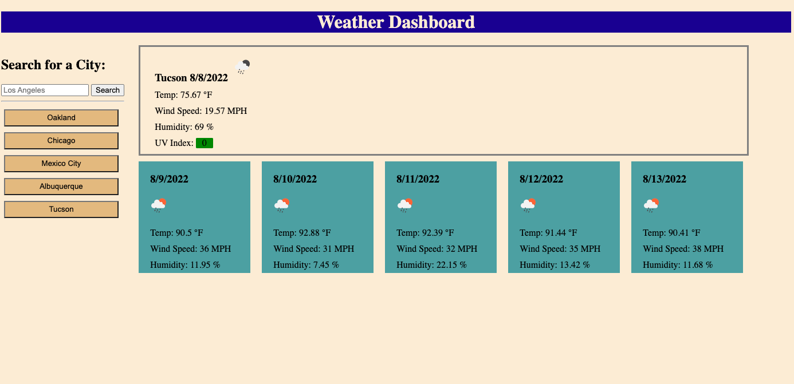

# Weather Dashboard
  

## Description
This application allows the user to input any city to search for the current weather conditions. The user is also shown a forcast for the upcoming five days. A button is automatically generated for any new city that has been searched and is saved under the search bar so that the user can simply click to check the conditions of their favorite places.

## Table of Contents
- [Installation](#installation)
- [Usage](#usage)
- [License](#license)
- [Contributing](#contributing)
- [Tests](#tests)
- [Questions](#questions)
- [Visuals](#visuals)

## Installation

This application is run in the browser.

## Usage

This application utilizes a third party API to call up-to-date and accurate information for nearly any city imaginable. This dynamic database along with the design of the application is very user friendly and offers an intutive experience.

## License
  
  This project uses the MIT license. 
  **If you have questions on the license please check the following site [choose a license](https://www.google.com)

## Contributing

If you wish to contribute feel free to send me an email.

## Tests

There is no testing in place for this application.

## Credits

This application is possible thanks to: 
[OpenWeather One Call API](https://openweathermap.org/api/one-call-api)

## Questions

Please feel free to explore my other projects on github: [tracyroseguajardo](https://www.github.com/tracyroseguajardo)

If you have further questions you may send me an email at: tracyroseguajardo@gmail.com

## Visuals

Link to deployed application:
[Weather Dashboard](https://tracyroseguajardo.github.io/weather-dashboard/)

Screenshot of application:

